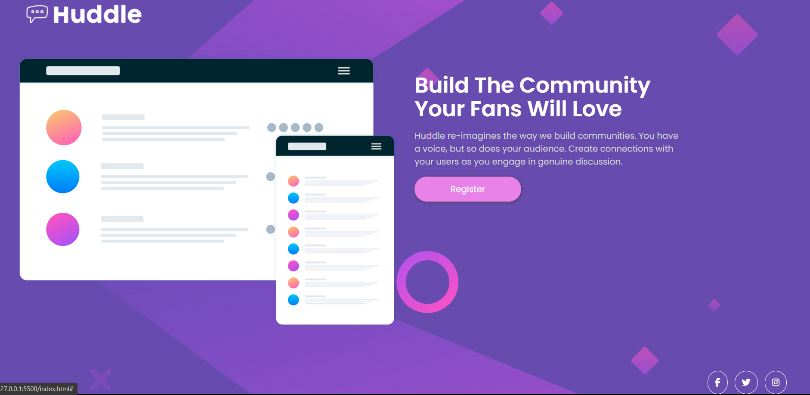
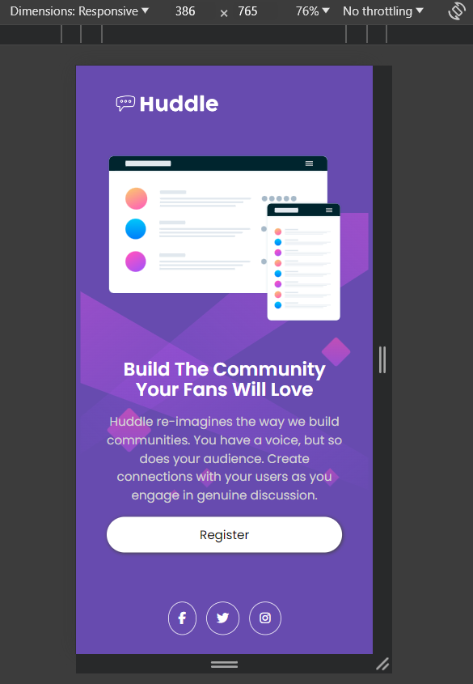

# Frontend Mentor - Huddle landing page with single introductory section solution

This is a solution to the [Huddle landing page with single introductory section challenge on Frontend Mentor](https://www.frontendmentor.io/challenges/huddle-landing-page-with-a-single-introductory-section-B_2Wvxgi0). Frontend Mentor challenges help you improve your coding skills by building realistic projects.

## Table of contents

- [Overview](#overview)
  - [The challenge](#the-challenge)
  - [Screenshot](#screenshot)
  - [Links](#links)
- [My process](#my-process)
  - [Built with](#built-with)
  - [What I learned](#what-i-learned)
  - [Continued development](#continued-development)
  - [Useful resources](#useful-resources)
- [Author](#author)

## Overview

### The challenge

Users should be able to:

- View the optimal layout for the page depending on their device's screen size
- See hover states for all interactive elements on the page

### Screenshot




### Links

- Solution URL: (https://github.com/hassanmoaa/huddle-landing-page-FrontEndMentor.git)
- Live Site URL: (https://cheerful-rolypoly-5f4514.netlify.app)

### Built with

[](https://skillicons.dev)

### What I learned

Practiced my media query skills and responsiveness skills plus flex-box.

```
  body {
    background-image: url(images/bg-mobile.svg);
    background-position: center;
    background-repeat: no-repeat;
    background-color: var(--Violet);
  }

    .anchor:hover,
.anchor:focus {
    background-color: var(--Soft-Magenta);
    color: white;
}
```

### Continued development

- I want to learn more about css by creating multi-page websites

### Useful resources

- (https://developer.mozilla.org/)
- (https://www.w3schools.com)

## Author

- Frontend Mentor - [@hassanmoaa](https://www.frontendmentor.io/profile/hassanmoaa)
